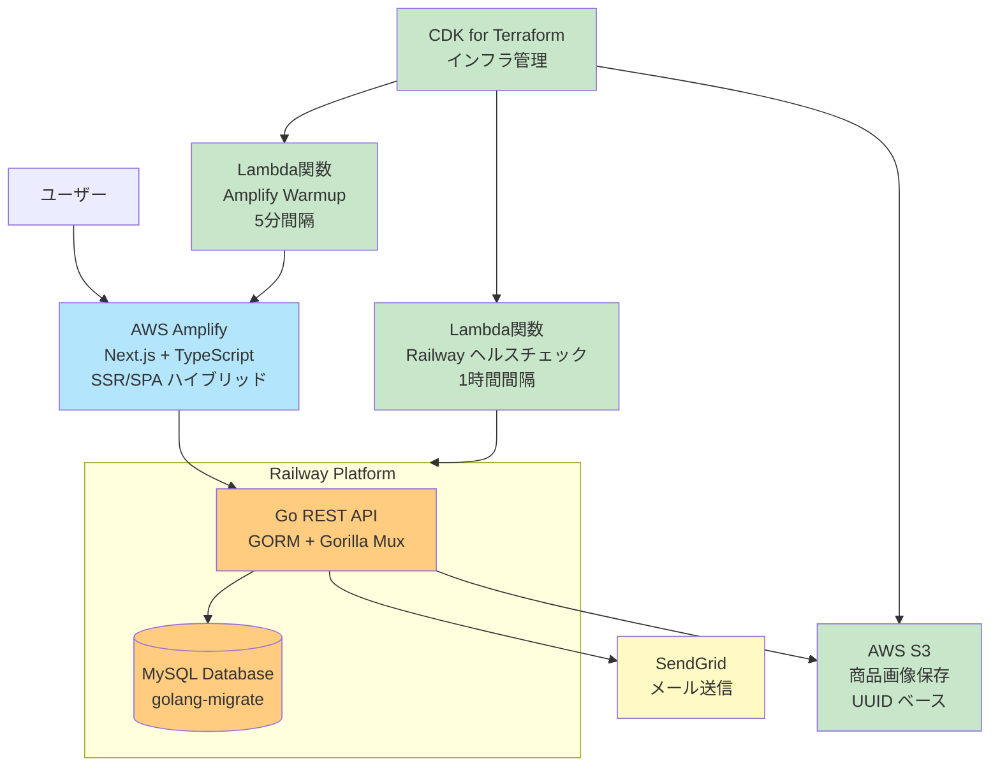

## サイト説明

ハンドメイドアクセサリーを制作・販売している**とこりり**のサイトです

## URL

<https://tocoriri.com>

## プロジェクト構成

```
tku/
├── frontend/          # Next.js フロントエンドアプリケーション
├── backend/           # Go REST API サーバー
└── infra/             # CDK for Terraform インフラコード
```

## ディレクトリ別の技術構成

### frontend/ - Next.js フロントエンドアプリケーション

| 内容                              | 補足                                                                                                                                                                                                                                                                                 |
| --------------------------------- | ------------------------------------------------------------------------------------------------------------------------------------------------------------------------------------------------------------------------------------------------------------------------------------ |
| Next.js + TypeScript を使って作成 | SSR/SPA ハイブリッドによる最適化されたパフォーマンス                                                                                                                                                                                                                                 |
| TypeScript を使用                 | 型安全な開発と保守性の向上を図る                                                                                                                                                                                                                                                     |
| 管理画面も自作                    | - 管理者のログイン機能<br/>- 商品情報、カテゴリー、販売サイトなどの作成、更新 <br/>などの基本動作から <br>- CSV を使った一括編集 <br/>- Creema(ハンドメイドアクセサリーサイト)の情報をスクレイピングし、そちらから商品情報を作成する <br/>など管理者の使いやすさを考慮した機能も実装 |
| レスポンシブデザイン              | モバイルファーストによる設計で、スマートフォンから PC まで最適化された UI/UX                                                                                                                                                                                                         |
| OGP も動的に変更されるように実装  | 動的に OGP が変更されるように実装しており、SNS でシェアした時もページにあった表示がされるように実装                                                                                                                                                                                  |
| アニメーションの実装              | 操作性重視の程よいアニメーションを意識して実装                                                                                                                                                                                                                                       |
| デプロイ先                        | AWS Amplify でホスティング、Git 連携による自動デプロイと SSR/SPA の最適化                                                                                                                                                                                                            |

### backend/ - Go REST API サーバー

| 内容                                     | 補足                                                               |
| ---------------------------------------- | ------------------------------------------------------------------ |
| 使用言語は Go                            | フレームワークは使用せずに作成を行っている                         |
| ORM は GORM を使用                       | Gorilla Mux を使って、RESTful API を作成                           |
| お問い合わせに対するメール送信機能も実装 | SendGrid を使用して作成                                            |
| デプロイ先                               | Railway でホスティング、コンテナベースの自動デプロイとスケーリング |
| テーブルの ver は golang-migrate で管理  | Railway 上で migrate を実行して DB の migration を管理             |

### infra/ - CDK for Terraform インフラコード

| 内容                                          | 補足                                                       |
| --------------------------------------------- | ---------------------------------------------------------- |
| 主要なインフラは CDK for Terraform でコード化 | AWS リソースの管理と Lambda 関数の定期実行タスクを実装     |
| Lambda 関数による定期実行                     | フロントエンドの lambda warmup・バックエンドヘルスチェック |

## 開発手法

| 内容                       | 補足                                                      |
| -------------------------- | --------------------------------------------------------- |
| AI 駆動開発                | Claude Code を活用した効率的な開発プロセス                |
| 自動化されたコード品質管理 | AI による一貫したコーディング規約の遵守とリファクタリング |
| 迅速なプロトタイピング     | AI 支援により短期間での MVP 開発と機能追加を実現          |

## インフラ構成


