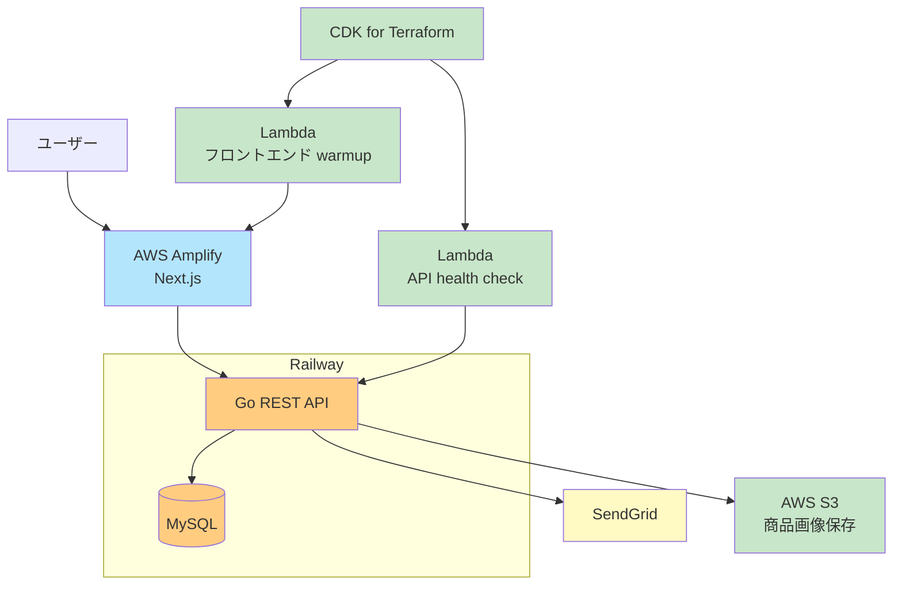

## サイト概要

ハンドメイドアクセサリー作家 **とこりり** の作品紹介・販売サイトです。
公開サイトとして運用しつつ、個人開発のポートフォリオとしても「設計」「保守性」「実運用を意識した実装」を示せる構成にしています。

## URL

<https://tocoriri.com>

## このリポジトリで重視していること

- 単なる LP ではなく、`frontend / backend / infra` を分離したフルスタック構成
- 実運用しやすい管理画面と、更新効率を上げる運用機能
- 一度作って終わりではなく、継続的に保守しやすいアーキテクチャ
- ローカルでも本番に近い構成を再現できる開発環境

## プロジェクト構成

```text
tku/
├── frontend/          # Next.js フロントエンド
├── backend/           # Go REST API
└── infra/             # CDK for Terraform による運用系インフラ
```

## 技術スタック

### frontend

- Next.js 15 + TypeScript
- App Router による SSR / SPA ハイブリッド構成
- Sass（CSS Modules）
- React Hook Form + Zod
- Storybook / Vitest / Testing Library

### backend

- Go 1.25
- Gorilla Mux
- sqlx + MySQL
- golang-migrate
- AWS S3
- SendGrid

### infra

- CDK for Terraform
- AWS Lambda
- EventBridge

## 実装上の強み

### 1. 管理画面まで含めて自作

- 商品、カテゴリ、タグ、販売サイトなどの CRUD を管理画面から操作可能
- 管理者ログイン、セッション管理、管理者権限チェックを実装
- CSV による商品データのエクスポート / インポートに対応

### 2. 商品運用を楽にする機能を実装

- Creema の商品ページをもとに、商品情報を複製する補助機能を実装
- 商品画像は S3 に保存し、UUID ベースで管理
- カルーセル用の表示データやカテゴリ別一覧など、公開側で使いやすい API を用意

### 3. 自作コンポーネントを軸にしたフロントエンド実装

- 主要な UI コンポーネントの大体を自作し、デザインと振る舞いを細かく調整
- `components` と `features` を分け、画面単位ではなく再利用可能な部品として設計
- 公開サイトと管理画面を同一アプリ内で運用し、機能追加や改修を一元管理
- Next.js 15 + App Router により、SEO と操作性を両立しやすい構成
- Storybook / Vitest / Testing Library により、UI の確認と品質管理を継続しやすい

### 4. DDD / Clean Architecture を前提にしたバックエンド設計

- DDD / Clean Architecture を意識して責務を分離
- `domain` / `usecase` / `interface` / `infra` のレイヤを分割
- `internal/app/di` に Composition Root を置き、依存関係を集約
- product は Query / Command を分離し、読み取りと更新の責務を整理

### 5. 実運用を意識した安全性

- 管理系 API は認証・管理者権限・Origin 検証を組み合わせて保護
- お問い合わせは保存だけでなく、SendGrid 連携で通知まで実装
- スキーマ変更は golang-migrate で履歴管理

### 6. ローカル再現性の高い開発環境

- `docker-compose` で frontend / backend / MySQL をまとめて起動可能
- ローカルでは MinIO を使って S3 互換ストレージも再現
- migrate コンテナを分離し、マイグレーションの適用フローも本番に寄せている

## ディレクトリ別の概要

### `frontend/`

- 公開サイトと管理画面を含む Next.js アプリケーション
- レスポンシブ対応、動的 OGP、適度なアニメーションを実装
- コンポーネント設計と Storybook によって UI を管理しやすく整理

### `backend/`

- フレームワークに依存しすぎない Go 製 REST API
- 商品、画像、作家情報、問い合わせ、認証などの API を提供
- 外部連携（S3 / SendGrid / Creema）を usecase から抽象化して組み込み

### `infra/`

- 定期実行の運用タスクを CDK for Terraform で管理
- フロントエンドの warmup と、バックエンドのヘルスチェックを自動化

## 品質面

- frontend は TypeScript と ESLint による静的検証に加え、Storybook とテストで UI 品質を確認
- backend はドメイン・ユースケース・HTTP 層を含めてテストを整備
- マイグレーションファイルを継続的に積み上げ、スキーマ変更履歴を管理
- AI を補助的に活用しつつ、設計判断と最終レビューは手動で実施

## 開発コマンド

### ルート

```bash
docker-compose up
```

### frontend

`cd frontend` のうえで、用途に応じて以下を実行します。

- 依存関係のインストール: `pnpm install`
- 開発サーバー起動: `pnpm dev`
- 本番ビルド: `pnpm build`
- Lint 実行: `pnpm lint`
- テスト実行: `pnpm test`

### backend

`cd backend` のうえで、用途に応じて以下を実行します。

- 起動: `go run ./cmd/api`
- ビルド確認: `go build ./...`
- テスト実行: `go test ./...`

### infra

`cd infra` のうえで、用途に応じて以下を実行します。

- 依存関係のインストール: `pnpm install`
- TypeScript のビルド: `pnpm build`
- CDK for Terraform の synth 実行: `pnpm synth`

## インフラ構成


```mermaid
graph TD
    User[ユーザー]
    SendGrid[SendGrid]

    Amplify[AWS Amplify<br/>Next.js]

    subgraph Railway[Railway]
        API[Go REST API]
        MySQL[(MySQL)]
    end

    S3[AWS S3<br/>商品画像保存]
    Warmup[Lambda<br/>フロントエンド warmup]
    Health[Lambda<br/>API health check]
    CDK[CDK for Terraform]

    User --> Amplify
    Amplify --> API
    API --> MySQL
    API --> S3
    API --> SendGrid

    Warmup --> Amplify
    Health --> API
    CDK --> Warmup
    CDK --> Health

    classDef frontend fill:#b3e5fc
    classDef backend fill:#ffcc80
    classDef infra fill:#c8e6c9
    classDef external fill:#fff9c4

    class Amplify frontend
    class API,MySQL backend
    class S3,Warmup,Health,CDK infra
    class SendGrid external
```
