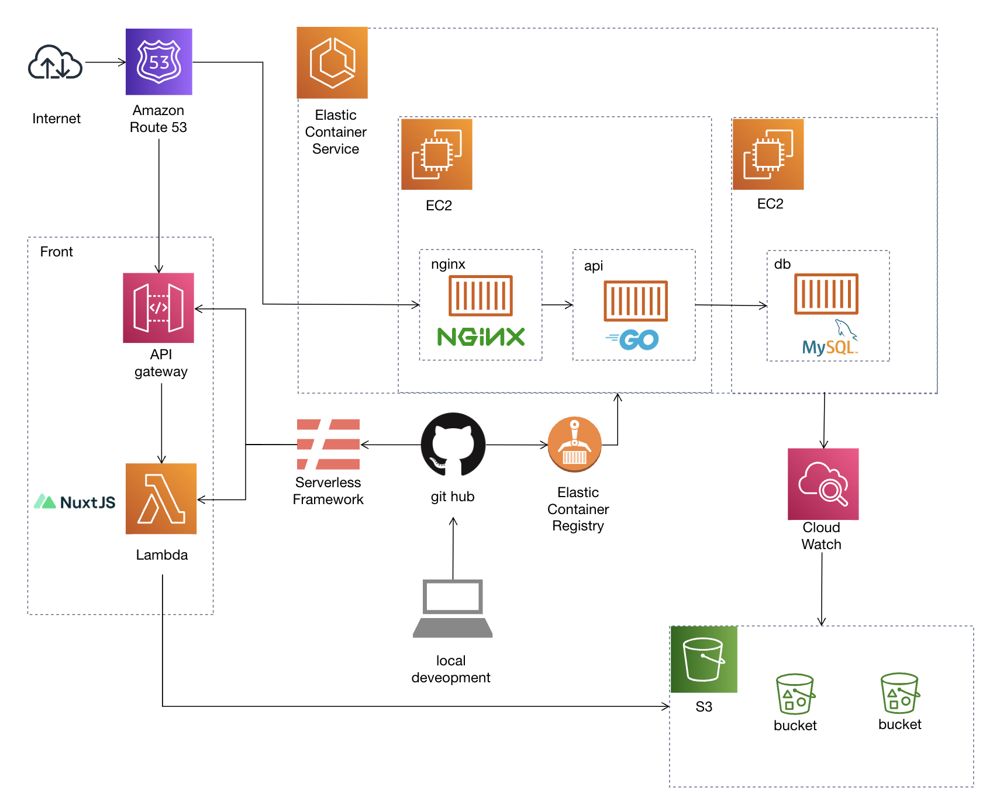

## サイト説明

こちらはハンドメイドアクセサリー作家 tku の商品販売サイトです。

## URL

<https://tocoriri.com>

## 技術的特徴

### フロントエンド

| 内容                                               | 補足                                                                                                                                                                                                                                                                                 |
| -------------------------------------------------- | ------------------------------------------------------------------------------------------------------------------------------------------------------------------------------------------------------------------------------------------------------------------------------------ |
| Vue.js(Nuxt.js)を使って作成                        | バージョンは Vue2, Nuxt2 で作成                                                                                                                                                                                                                                                      |
| TypeScript を使用                                  | nuxt-property-decorator を使って TypeScript に対応するように実装                                                                                                                                                                                                                     |
| 管理画面も自作                                     | - 管理者のログイン機能 - 商品情報、カテゴリー、販売サイトなどの作成、更新  などの基本動作から  - CSV を使った一括編集  - Creema(ハンドメイドアクセサリーサイト)の情報をスクレイピングし、そちらから商品情報を作成する  など管理者の使いやすさを考慮した機能も実装 |
| スマートフォンと PC でデザインでデザインを使い分け | スマートフォンでも、タブレット・PC でも見やすく使いやすいデザインを意識して作成を行っている                                                                                                                                                                                          |
| OGP も動的に変更されるように実装                   | 動的に OGP が変更されるように実装しており、SNS でシェアした時もページにあった表示がされるように実装                                                                                                                                                                                  |
| アニメーションの実装                               | 操作性重視の程よいアニメーションを意識して実装                                                                                                                                                                                                                                       |

### サーバーサイド

| 内容                                     | 補足                                                                          |
| ---------------------------------------- | ----------------------------------------------------------------------------- |
| 使用言語は Go                            | フレームワークは使用せずに作成を行っている                                    |
| ORM は GORM を使用                       | gorilla mux を使って、RESTful API を作成                                      |
| お問い合わせに対するメール送信機能も実装 | sendgrid を使用して作成                                                       |
| テーブルの ver は golang-migrate で管理  | ECS で migrate 用のタスクを起動することで、DB の migration ができるように実装 |

### インフラ

| 内容                                                 | 補足                                                                        |
| ---------------------------------------------------- | --------------------------------------------------------------------------- |
| CI/CD は github actions で作成                       | フロントエンドとサーバーサイドの自動更新を行う                              |
| client(フロントエンド)は lambda + api gateway で構築 | デプロイ時に serverless framework を使って自動更新される                    |
| api(サーバーサイド)は ECS で構築                     | デプロイ時に ECR を更新した後、最新のイメージを使ってタスクが自動更新される |
| 主要なインフラは CDK for Terraform でコード化        | ネットワーク周り、および ECS 周りのリソースは CDK for Terraform でコード化  |

## インフラ構成図

