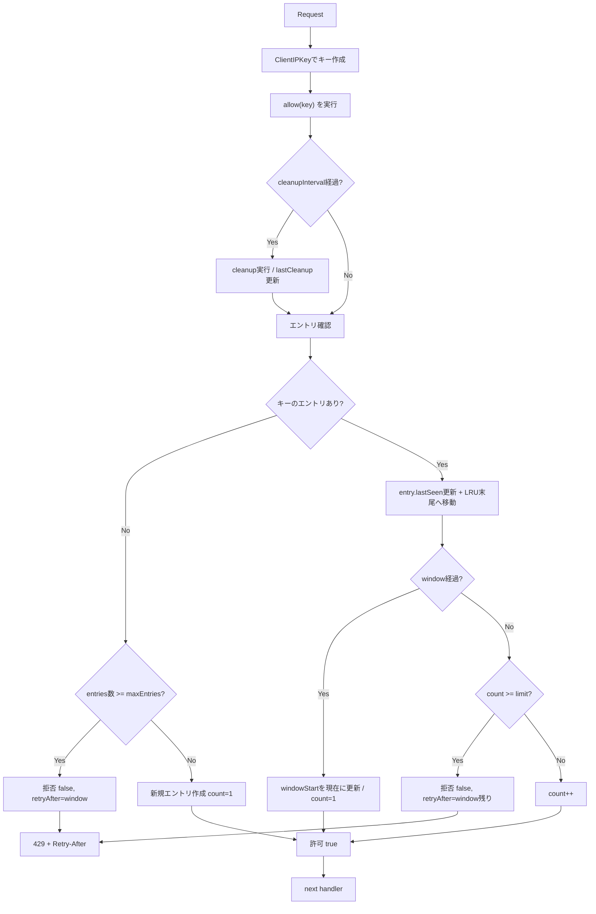

# Rate Limit Middleware

## 1. 何をしているか（概要）

`internal/interface/http/middleware/rate_limit.go` は、APIへのアクセス回数を「クライアント単位」で制限するミドルウェアです。  
方式は **固定ウィンドウ方式** です。

- 1クライアントごとにカウンタを持つ
- 一定時間（デフォルト 1分）ごとに回数を数える
- 上限を超えたら `429 Too Many Requests` を返す
- いつ再試行できるかを `Retry-After` ヘッダで返す

---

## 2. デフォルト設定

- 1分あたり上限: `5`
- ウィンドウ: `1 minute`
- 管理エントリ最大数: `10000`
- cleanup 1回あたりの削除上限: `128`

---

## 3. クライアント識別（どのIPで数えるか）

`ClientIPKey` で次の優先順にIPを決定します。

1. `CF-Connecting-IP`（Cloudflare経由時）
2. `X-Forwarded-For` の先頭IP
3. `X-Real-IP`
4. `RemoteAddr`
5. どれも不正/空なら `unknown`

ポイント:

- 文字列をそのまま使わず `net.ParseIP` で妥当性チェック
- `X-Forwarded-For` は `a, b, c` の先頭のみ採用

---

## 4. リクエスト時の処理フロー

---

## 5. cleanup（古いエントリ削除）

メモリが増え続けないよう、一定間隔で古いキーを削除します。

- cleanup実行タイミング: `allow` 呼び出し時に `cleanupInterval` 経過していたら
- stale判定: `lastSeen < now - staleTTL`
- `staleTTL` は `window * 5`
- 1回で全部は消さず、`cleanupBatchSize` 件まで削除

内部では LRU リスト（`container/list`）を使って、

- 使われたエントリを末尾に移動（`MoveToBack`）
- 古い候補は先頭（`Front`）から確認

という形で効率よく掃除しています。

---

## 6. 429を返すとき

上限超過時は次を返します。

- Status: `429 Too Many Requests`
- Header: `Retry-After: <秒>`
- Body: エラーメッセージ（`defaultRateLimitExceededMessage`）

`Retry-After` は秒に切り上げて計算し、最低 `1` 秒を保証します。

---

## 7. 実装上の意図（設計メモ）

- `NewRateLimitMiddleware`: 公開API（通常利用向け）
- `newRateLimitMiddlewareWithOptions`: 内部用（テストで細かい条件を作るため）
- `map + mutex` でキー別カウンタを安全に更新
- `LRU + batch cleanup` で大規模アクセス時の掃除コストを平準化
